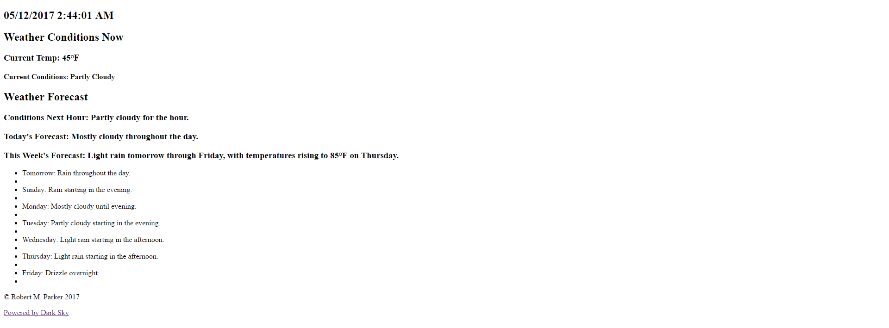
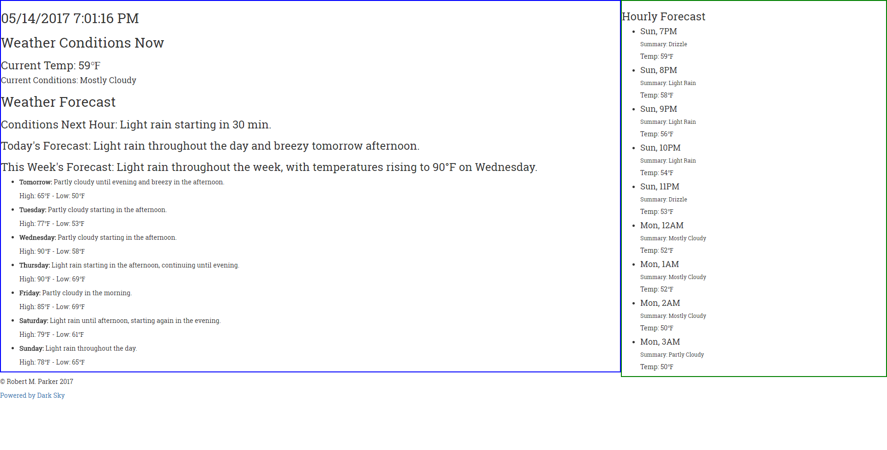

# WeatherApp

Weather app that displays weather data on server side via node and then on client side after server side code is run and data is stored in JSON file. Client side pulls from JSON file to display data and JSON file is overwritten each time server code is run.

Client side screenshot - 5/12/17

Added daily temps and hourly forecast - 5/14/17

Next steps:
    Keep adding more data from API (precipitation, wind, etc.)
    find and add icons
    move data storage from json file to a DB (mongoDB, firebase?)

[Powered by Dark Sky](https://darksky.net/poweredby/)
